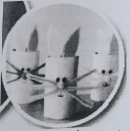
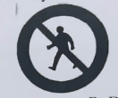
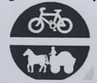
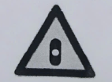
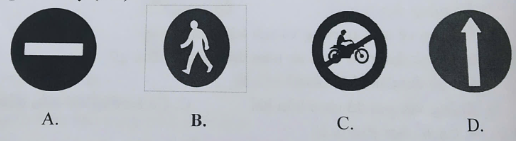

HỌ VÀ TÊN: ............................................. LỚP: ..........

ÔN THI MÔN CÔNG NGHỆ CUỐI HỌC KÌ 2

A. TRẮC NGHIỆM

Câu 1: Vật liệu ống hút giấy, dây buộc, đất nặn, giấy bìa có tính chất?

A. Mềm.

*B. Thấm nước.

C. Không thấm nước.

Câu 2: Vật liệu nào không dùng làm thủ công?

A. Giấy màu

B. Hồ dán

*C. Hoa

D. Đáp án khác

Câu 3: Công dụng của giấy màu thủ công để làm thước kẻ bằng giấy là

A. dán các phần của thước kẻ vào nhau.

B. cắt giấy, bìa.

*C. trang trí thước kẻ.

Câu 4: Sắp xếp thứ tự để làm đồ dùng học tập là

A. Tiến hành làm và trang trí sản phẩm.

*B. Tìm hiểu sản phẩm mẫu.

C. Kiểm tra sản phẩm sau khi làm.

D. Lựa chọn vật liệu và dụng cụ phù hợp.

A. a - b - c - d.

B. b - d - a - c.

C. c - b - d - a.

D. d - a - c - b.

Câu 5: Sản phẩm thủ công dưới đây được làm từ vật liệu nào?

{width="2.321527777777778in"
height="2.3305555555555557in"}

A. sản phẩm làm từ giấy thủ công.

B. sản phẩm làm từ bìa, dây buộc.

*C. sản phẩm làm từ giấy thủ công, dây buộc.

Câu 6: Để làm thành biển báo giao thông thì cần phải làm gì?

*A. Lắp ráp các vật liệu với nhau

B. Sơn màu cho biển báo giao thông

C. Trang trí cho biển báo giao thông

Câu 7: Biển báo giao thông có ý nghĩa gì?

*A. Hướng dẫn người và phương tiện giao thông đúng luật

B. Làm đồ trang trí

C. Để chỉ dẫn cho động vật

Câu 8: Nên làm gì khi thấy biển báo giao thông?

A. Không quan tâm

B. Vi phạm các quy định

*C. Tuân thủ đúng các quy định mà biển báo hướng dẫn

Câu 9: Ý nghĩa biển báo trong hình dưới đây

{width="1.3736111111111111in"
height="1.1479166666666667in"}

*A. Cấm người đi bộ.

B. Đường dành cho xe thô sơ.

C. Đường cấm.

Câu 10: Ý nghĩa biển báo trong hình dưới đây

{width="1.2784722222222222in"
height="1.1041666666666667in"}

A. Dành cho người tàn tật.

B. Dành cho người đi bộ.

*C. Đường dành cho xe thô sơ.

Câu 11: Ý nghĩa biển báo trong hình dưới đây

{width="1.4784722222222222in"
height="1.0958333333333334in"}

*A. Giao nhau có tín hiệu đèn.

B. Cấm xe đạp.

C. Đi bộ.

Câu 12: Ý nghĩa của tên biển báo Đường người đi bộ sang ngang là:

*A. Chỉ dẫn cho người đi bộ và người lái xe biết nơi dành cho người đi bộ
sang ngang.

B. Bắt buộc các loại xe thô sơ (kể cả xe của người tàn tật) và người đi
bộ phải dùng đường dành riêng này để đi và cấm các xe cơ giới kể cả xe
gắn máy, các xe được ưu tiên theo quy định đi vào đường đã đặt biển này.

C. Báo cho các loại xe (thô sơ và cơ giới) phải chạy vòng theo đảo an
toàn ở nơi đường giao nhau.

Câu 13: Đồ chơi nào an toàn khi chơi?

*A. Chơi lắp ráp trong nhà

B. Các bạn thả diều gần khu vực có đường điện cao thế

C. Hai bạn chơi ô tô khi trời mưa

Câu 14: Đồ chơi phù hợp với lứa tuổi có lợi gì?

A. Giải trí

B. Phát triển trí thông minh

*C. Cả hai đáp án trên đều đúng

Câu 15: Vật liệu nào dưới đây là vật liệu dùng để làm mô hình xe?

A. Túi giấy bóng

B. Bút màu

*C. Kéo cắt giấy

Câu 16: Để làm gắn bánh xe vào trục bánh xe cần làm theo mấy bước?

*A. Hai bước

B. Ba bước

C. Năm bước

Câu 17: Vì sao nên làm đồ chơi từ vật liệu đã qua sử dụng?

A. Để cho dễ làm

B. Để trông đẹp hơn

*C. Để bảo vệ môi trường và tiết kiệm chi phí

Câu 18: Để sử dụng đồ chơi an toàn thì cần phải làm gì?

A. Cất đồ chơi sau khi chơi

B. Không vứt pin đồ chơi bừa bãi

*C. Cả ba đáp án trên đều đúng

Câu 19: Cách chơi Rubik là

*A. xoay các mặt của khối ru bích để đưa nó về để nó về hình dạng sao cho
6 mặt màu đồng nhất.

B. chọn và xếp hình thích hợp vào khoảng trống của nó trên ngôi nhà.

C. người chơi đứng vào khoảng trống trên thân máy bay, giữ máy bay ngang
người sau đó chạy đua xem ai lái về đích trước.

Câu 20: Các món đồ chơi không phù hợp với lứa tuổi học sinh là

A. bộ đồ chơi xếp gỗ.

B. bóng đá.

*C. đua xe mạo hiểm.

Câu 21: (1 điểm) vật liệu và dụng cụ nào được chọn làm thước kẻ thẳng
bằng giấy? (M2)

*A. giấy bìa, giấy thủ công, keo dán, thước, bút chì, kéo.

B. bút lông, giấy màu, băng keo, màu, giấy thủ công.

C. giấy màu, băng keo, màu, giấy thủ công.

Câu 22: (1 điểm) Khoanh tròn vào câu trả lời đúng nhất, ứng với yêu cầu
chuẩn bị làm thước kẻ bằng giấy có độ dài không quá 20 cm. (M2)

A. 2 hình chữ nhật có kích thước 3cm x 20cm.

*B. 2 hình chữ nhật có kích thước 3cm x 21cm.

C. 4 hình chữ nhật có kích thước 3cm x 21cm.

Câu 23: (1 điểm) Biển báo cấm xe đi ngược chiều gồm có mấy bộ phận. (M3)

A. 3 bộ phận.

B. 5 bộ phận.

*C. 4 bộ phận.

Câu 24: (1 điểm) quan sát những hình sau đã cho, đâu là biển báo hướng
dẫn người đi bộ. (M1)

{width="5.373611111111111in"
height="1.4694444444444446in"}

A. a

*B. b

C. c

D. d

Câu 25: (1 điểm) bộ phận chính của mô hình xe đồ chơi gồm: (M3)

A. Đầu máy xe, càng mũi, đuôi xe.

*B. Thân xe, trục bánh xe, bánh xe.

C. Buồng lái, càng mũi, bánh xe, đuôi xe.

Câu 26: (1 điểm) (M2) Khi chọn vật liệu làm thủ công, cần chọn loại có
tính chất như thế nào?

A. Phù hợp và an toàn.

B. Tận dụng vật liệu tái chế.

*C. Tất cả các đáp án

